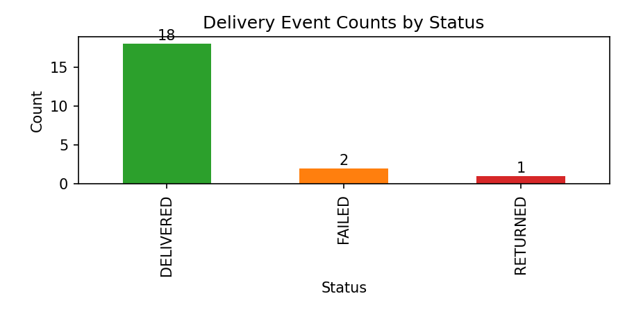

Subject: Request to Approve Short Reconciliation Triage — Payments vs Delivery

Dear [Client Name],

Executive summary
- Deliveries sample: 21 events (18 DELIVERED, 2 FAILED, 1 RETURNED). Payments sample: 26 records (raw total ETB 16,640).
- Immediate concerns: duplicate payments (two duplicate groups), three payments with no matching delivery, and three payments tied to FAILED/RETURNED deliveries.

Business implication
- Left unresolved, these discrepancies can inflate revenue reporting, create billing exceptions, and undermine trust in KPIs used by Finance and Operations.

Evidence (sample)
- Duplicate payments: P1006 & P1021 (O5006, 800 ETB); P1014 & P1022 (O5014, 530 ETB).
- Payments without delivery: P1023 (O5021, missing package_id), P1024 (O5022), P1025 (O5023).
- Payments on non-final deliveries: D2016/D2017 (FAILED) paired with P1016/P1017; D2020 (RETURNED) paired with P1020.

Visualization

Recommended next steps (clear and time-boxed)
1) Quick Triage (recommended): 2–3 person-days. Join on `order_id` (primary) and `package_id` (secondary), produce: duplicate list, payments-without-delivery sample, deliveries-without-payment sample, and classify each mismatch by likely cause (timing, definition, data-quality). Deliverable: 1‑page findings and prioritized fixes with effort estimates.

Indicative logistics and cost
- Target start: within the week (proposed window: 2026-02-09 → 2026-02-13). SME alignment: one 60‑minute session during that week.
- Estimated effort: 2–3 person‑days. Indicative cost: USD 1,600–2,400 (subject to final staffing and rates).

2) Targeted Remediation: scoped engineering and 1–2 SME sessions if triage indicates systemic issues.

Request
Please approve the Quick Triage and confirm SME availability for a 60‑minute alignment in the proposed week. On approval we will share the 1‑page plan and begin work.

Regards,
Lemlem
Data Engineering Team

Key metrics (sample)

| Metric | Value |
|---|---:|
| Total deliveries (sample) | 21 |
| Total payments (sample) | 26 |
| Payment - Delivery delta | +5 records (~24%) |
| Unmatched payments (count) | 3 |
| Unmatched payments (amount) | ETB 1,850 |
| Duplicate excess amount (estimated) | ETB 1,330 |
| Payments total (sample) | ETB 16,640 |

Sample unmatched payments (payments with no delivery)

| payment_id | order_id | amount | payment_date | payment_status |
|---|---|---:|---|---|
| P1023 | O5021 | 500 | 2026-01-29 | PAID |
| P1024 | O5022 | 600 | 2026-01-15 | REFUNDED |
| P1025 | O5023 | 750 | 2026-01-10 | PAID |

Notes: the delta and amounts above are calculated from the provided samples. The Quick Triage will validate these figures across a representative window and provide precise reconciled totals.
