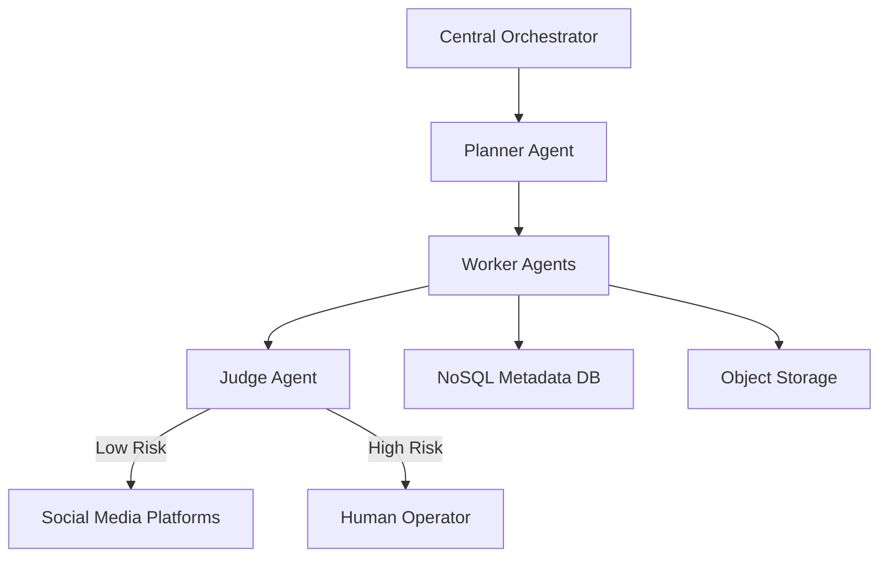

## 5. Architecture Diagram (Mermaid.js)

```mermaid
flowchart TD
    Human[Human Operator]
    Orchestrator[Central Orchestrator]
    Planner[Planner Agent]
    Worker[Worker Agents]
    Judge[Judge Agent]
    NoSQL[NoSQL Metadata DB]
    Storage[Object Storage]
    Social[Social Media Platforms]

    Orchestrator --> Planner
    Planner --> Worker
    Worker --> Judge
    Judge -->|Low Risk| Social
    Judge -->|High Risk| Human
    Worker --> NoSQL
    Worker --> Storage
```    