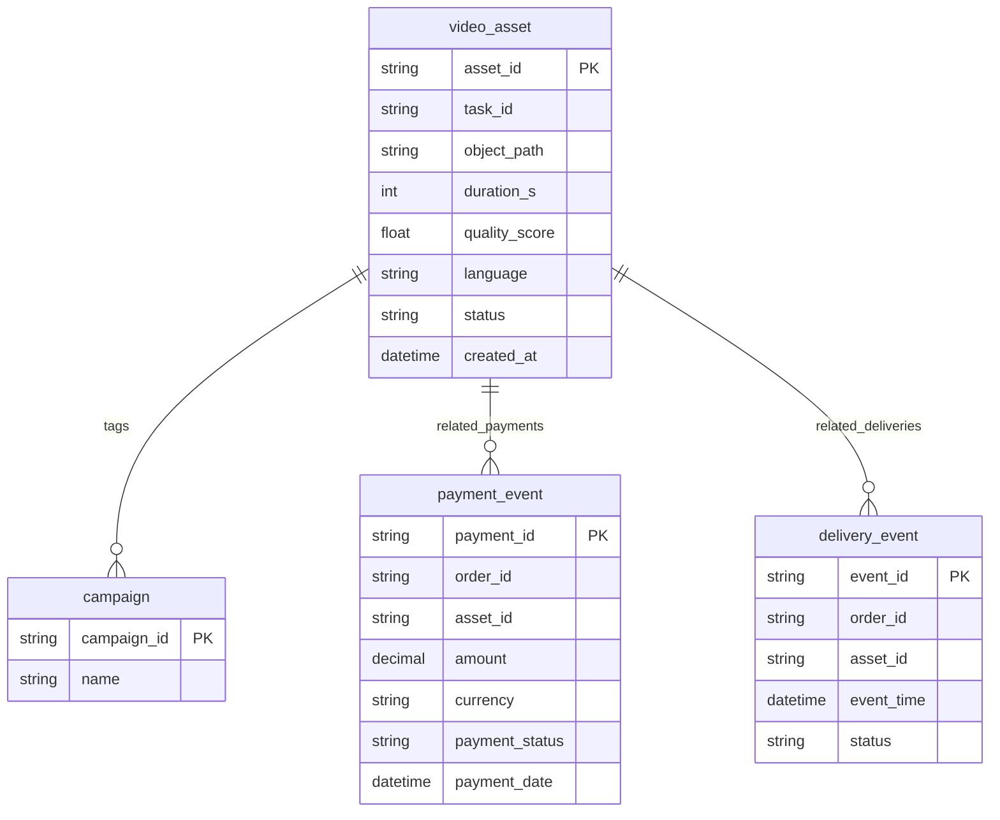

# Technical Specification — Project Chimera

## API Contracts (Agent JSON contracts)

1) Planner → Worker: Task dispatch

POST /api/agent/task
Request JSON:
```json
{
  "task_id": "uuid-v4",
  "task_type": "generate_content",
  "context": {
    "brand": "AcmeCo",
    "tone": "informal",
    "campaign_tags": ["launch-42"]
  },
  "payload": {
    "prompt": "Write a 30s script on product X",
    "media_types": ["text","audio","short_video"]
  },
  "deadline": "2026-02-10T10:00:00Z"
}
```

Response:
```json
{ "status": "accepted", "task_id": "uuid-v4" }
```

2) Worker → Judge: Asset submission

POST /api/agent/asset
Request JSON:
```json
{
  "asset_id": "uuid",
  "task_id": "uuid",
  "object_path": "s3://bucket/key.mp4",
  "metadata": {
    "duration_s": 30,
    "language": "en",
    "quality_score": 0.78
  }
}
```

Response: `{ "status":"submitted", "asset_id":"uuid" }`

3) Judge → Publish/Queue: Decision

POST /api/agent/decision
Request JSON:
```json
{
  "asset_id":"uuid",
  "decision":"APPROVE|QUEUE_FOR_REVIEW|REJECT",
  "reasons": ["toxicity","brand-mismatch"],
  "notes": "Short rationale for auditors"
}
```

Response: `{ "status":"ok" }`


## Database Schema (ERD) — Video Metadata (Mermaid)



Notes:
- Use a NoSQL store (e.g., DynamoDB / MongoDB / Cassandra) for `video_asset` and time-series engagement, with an append-only ledger (or event store) for `payment_event` and `delivery_event` to support audit trails.
- Use object storage (S3/GCS) for heavy binary assets; store only URIs in DB.

## Operational considerations
- Authentication: Agents authenticate with short-lived service tokens; human users via SSO (OIDC).
- Observability: Emit structured traces and metrics (OpenTelemetry) for task latencies and reconciliation delta counts.
- Backups & Retention: Retain reconciled event logs for 2 years; snapshot DB weekly.
